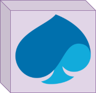

# Draw.io / Diagrams.net

https://drawio-app.com/

> draw.io is currently renaming into diagrams.net

The diagrams can be saved in PNG or SVG to be integrated into documentation. The PNG or SVG files can be re-opened with the editor to change the diagram (the source code of the diagram is embedded into the picture).

## Online editor

https://www.diagrams.net/ (http://www.draw.io/)

The online editor allow you to directly commit changes after editing.

## Desktop editor

https://github.com/jgraph/drawio-desktop/releases/

Identical to the online editor , but you can not connect directly to Github.

## How to include into Markdown file

https://github.com/jgraph/drawio-github

### Caching

To display images into Markdown files, Github use a cache system, changing a image can not be immediately visible in the rendered Markdown. The png files also have caching while been displayed on the website, svg format is more reactive.

### Example (png)

> The git branch has to be defined into the edit link and is not dynamic

[edit the diagram (.png)](https://app.diagrams.net/#HCapgemini-Architects%2Fdiagrams-examples%2Fmaster%2Fdiagrams.net%2Fdiagram-png.png)

### Example (svg)

> The git branch has to be defined into the edit link and is not dynamic

[edit the diagram (.svg)](https://app.diagrams.net/#HCapgemini-Architects%2Fdiagrams-examples%2Fmaster%2Fdiagrams.net%2Fdiagram-svg.svg)

## GRAF library integration

You can find 3 libraries related to GRAF under the libraries folder. These libraries can be added to the desktop and the online version of draw.io
