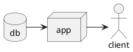

# PlantUML

https://plantuml.com/fr/

## Online editor

http://www.plantuml.com/plantuml/uml/

## Desktop editor

Edit diagram with [vscode](https://code.visualstudio.com/) : https://marketplace.visualstudio.com/items?itemName=jebbs.plantuml

## How to include into Markdown file

https://gist.github.com/noamtamim/f11982b28602bd7e604c233fbe9d910f

### Example (Dynamic)

The image is created directly form the source code of the diagram.

> The git branch has to be defined into the link and is not dynamic

### Example (Static)

